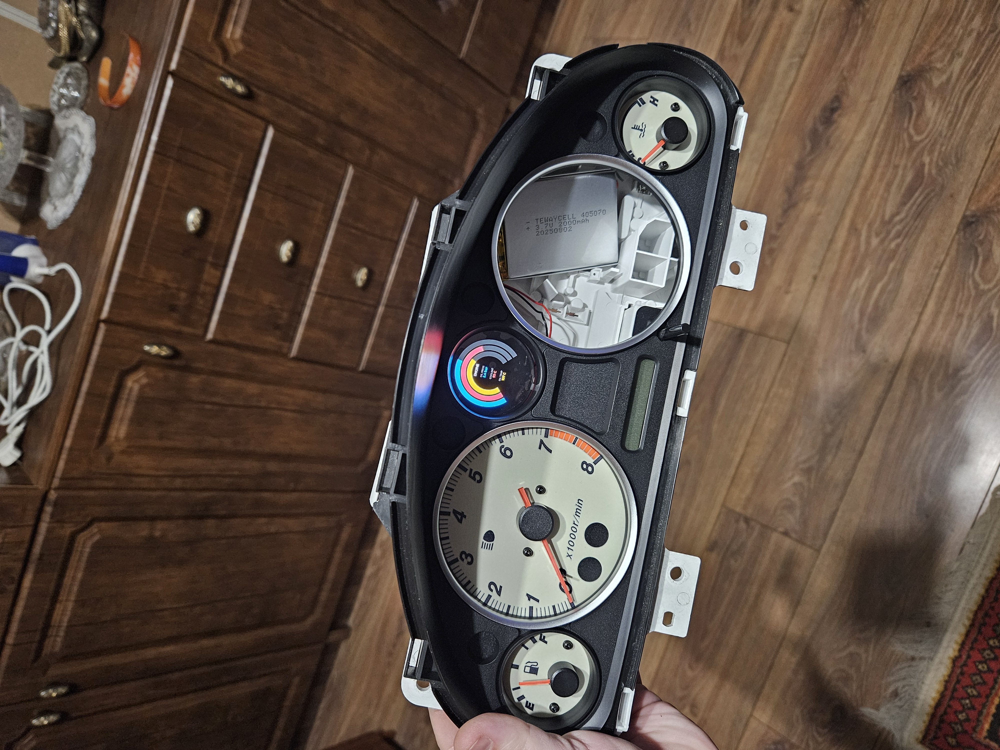

# Mazda MX-5 NB minidash
  Mini gauge display for Mazda MX-5 NB — oil pressure, temps, ECU data (Invent Labs, ME442). Replaces stock oil pressure gauge (or other 42mm gauge)
  Waveshare RP2350 + 1.43" AMOLED - https://www.waveshare.com/product/rp2350-touch-amoled-1.43.htm
  Preview:
  
## 3D Model
  3D models designed for 3D printing to mount the display to replace the factory gauge
## Demo
  Firmware source code for Demo application
## Invent Labs EMS (While this integration is not implemented)
  Firmware source code and scematic for EMS BUS intergate 
  
  Invent Labs EMS Bus is RS232, speed 19200bps
## ME442 (While this integration is not implemented)
  Firmware source code and scematic for ME442 CAN intergate 
  
  ME442 CAN is CAN2.0b, variable speed, 
## Images
  Image for readme
